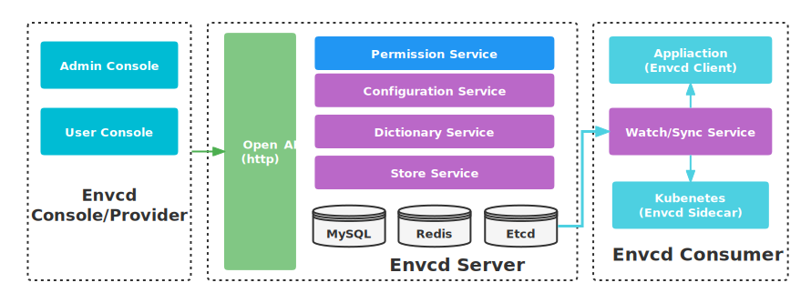

# envcd

environment configurations detector/discovery/dictionary

[](https://github.com/acmestack/envcd/blob/main/LICENSE)
[](#)
[](https://goreportcard.com/report/github.com/acmestack/envcd)
[](https://codecov.io/gh/acmestack/envcd)
[](#)
[](https://github.com/acmestack/envcd/releases)

## Software Architecture


## Stargazers over time

[](https://starchart.cc/acmestack/envcd)

## Contribute and Support

- [How to Contribute](https://acmestack.org/docs/contributing/guide/)

## Code Comment Polish

* you can comment with idea plugin `Gonano`

```go
// NewAsyncWriter Write data with Buffer, this Writer and Closer is thread safety, but WriteCloser parameters not safety.
//  @param w       Writer
//  @param bufSize accept buffer max length
//  @param block   if true, overflow buffer size, will blocking, if false will occur error
//  @return *AsyncLogWriter
func NewAsyncWriter(w io.Writer, bufSize int, block bool) *AsyncLogWriter {
}
```

